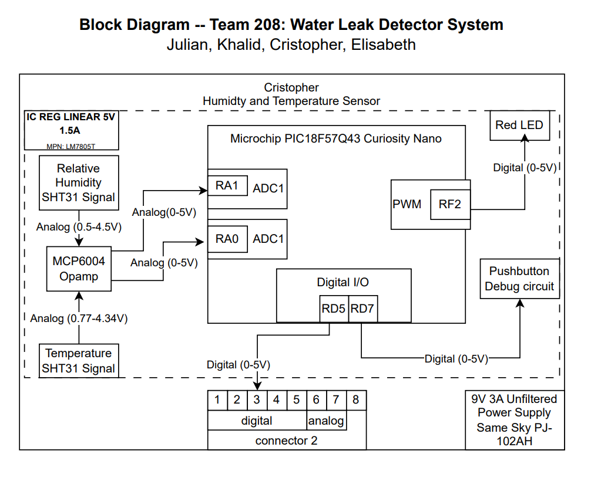

## Overview of Block Diagram

This block diagram represents the design of the Humidity and Temperature Subsystem, which is responsible for monitoring environmental conditions and detecting possible water leaks.

A linear voltage regulator (LM7805T) supplies a regulated 5 V output to all components within the subsystem, including the SHT31-ARP-B humidity and temperature sensor, the red LED indicator, and the pushbutton debug circuit.

The SHT31 sensor outputs two analog signals:

Relative Humidity (RH) Signal — approximately 0.5 V to 4.5 V range

Temperature (T) Signal — approximately 0.77 V to 4.34 V range

Both analog outputs are fed into the Microchip PIC18F57Q43 Curiosity Nano through pins RA1 and RA0, respectively, where they are read by the MCU’s ADC1 module. These readings allow the microcontroller to monitor changes in humidity and temperature continuously.

If the measured humidity surpasses a defined threshold (indicating a potential leak), the firmware triggers a digital output on pin RD5/RD7, routed through pin 3 of the team connector. This digital signal communicates with the main subsystem responsible for the alarm speaker, notifying it to activate the alert.

Additionally:

- The Red LED (driven by PWM output RF4) provides a visual indicator for debugging or alarm testing.

- The pushbutton debug circuit allows manual input testing and verification of system response.

- The team connector includes both digital and analog channels for inter-subsystem communication.

Overall, this subsystem acts as the environmental sensing front-end of the water leak detection system—providing real-time humidity and temperature data, threshold detection, and digital communication to the alarm subsystem.

