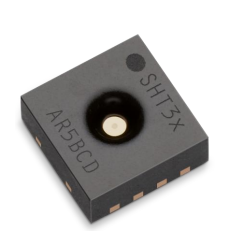
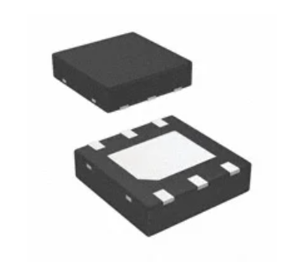
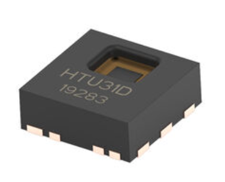
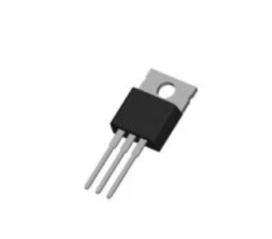
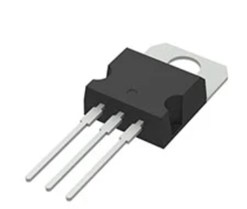
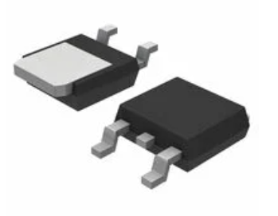
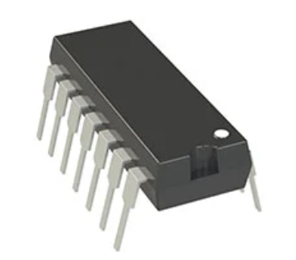
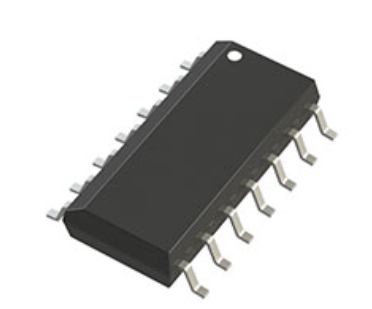
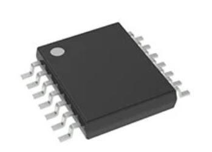

## Humidity / Temperature Sensors

| Image | Solution (Price) | Pros | Cons | Link |
|:------|:-----------------|:-----|:------|:------|
|  | **SHT31-ARP-B**   $4.32/unit | - Fits preferred voltage supply   - Parallel measurement of temperature and humidity   - Analog Voltage output   - Simple application circuit   - Sensirion datasheet contains useful application info | - Tiny 2.5mm × 2.5mm   - Exposed pads (no actual pins) | [Link to Product](https://www.digikey.com/en/products/detail/sensirion-ag/SHT31-ARP-B/5872251?gclsrc=aw.ds&gad_source=1&gad_campaignid=120565755&gbraid=0AAAAADrbLlghcdkRDNUkNksnhJdizNYYQ&gclid=EAIaIQobChMIyaDUvfXDkAMVNFR_AB1A9gBTEAAYASAAEgIRzPD_BwE) |
|  | **HDC2080DMBR**   $1.94/unit | - Less expensive   - Slightly bigger (easier to solder)   - Texas Instruments   - Good sensor documentation | - I²C output (not introduced in class)   - Exposed pads (no actual pins) | [Link to Product](https://www.digikey.com/en/products/detail/texas-instruments/HDC2080DMBR/9692560?_gl=1*18c5c7d*_up*MQ..*_gs*MQ..&gclid=EAIaIQobChMIyaDUvfXDkAMVNFR_AB1A9gBTEAAYASAAEgIRzPD_BwE&gclsrc=aw.ds&gbraid=0AAAAADrbLlghcdkRDNUkNksnhJdizNYYQ) |
|  | **10142048-32**   $2.70/unit | - Fits preferred voltage supply   - Analog   - Less expensive than SHT31 | - Exposed pads (no actual pins)   - Limited datasheet information   - Tiny 2.5mm × 2.5mm | [Link to Product](https://www.digikey.com/en/products/detail/te-connectivity-measurement-specialties/10142048-32/15188988) |

**Choice:** `SHT31-ARP-B`  
**Rationale:**  
Despite being relatively costly, Sensirion sensors are known for their excellent reliability and comprehensive documentation, simplifying circuit development. The SHT31 is compact yet precise ; ideal for the environmental conditions expected in our water-leak detection design. Its ability to operate two signal lines simultaneously enables flexibility in end-user applications. The primary purpose of this sensor is to detect humidity changes caused by potential water leaks.

---

## Voltage Regulators

| Image | Solution (Price) | Pros | Cons | Link |
|:------|:-----------------|:-----|:------|:------|
|  | **LM7805T**   $0.33 (100-unit qty) | - Readily available in lab   - Familiar component   - Well-protected   - Through-hole pins (easy to solder) | - Limits flexibility for designs outside 5V | [Link to Product](https://www.digikey.com/en/products/detail/taejin/LM7805T/22237260) |
|  | **L7805CV**   $0.50/unit | - Good alternative if LM7805T unavailable   - Through-hole pins (easy to solder)   - Protection features | - May require heatsink | [Link to Product](https://www.digikey.com/en/products/detail/stmicroelectronics/L7805CV/585964) |
|  | **MC7805CDT**   $0.46/unit | - Through-hole pins (easy to solder)   - Well-protected   - Compact SMT | - Outputs 1A (harder to cool)   - Requires large copper area   - Current limitations may affect design | [Link to Product](https://www.digikey.com/en/products/detail/onsemi/MC7805CDTRKG/921037) |

**Choice:** `LM7805T`  
**Rationale:**  
The LM7805T is a well-rounded and reliable choice. It offers solid protection features and a through-hole package that’s easy to handle and solder. Though it limits flexibility in voltage options, its performance suits this subsystem’s parameters and is easily replaceable due to local availability.

---

## Operational Amplifiers (Op-Amps)

| Image | Solution (Price) | Pros | Cons | Link |
|:------|:-----------------|:-----|:------|:------|
|  | **MCP6004**   $0.59/unit | - Readily available in lab   - Familiar component   - Through-hole pins (easy to solder)   - 4 op-amps   - Works at 5V | - 1 MHz GBW and modest precision/noise (not ideal for high-bandwidth or precision tasks) | [Link to Product](https://www.digikey.com/en/products/detail/microchip-technology/MCP6004-I-P/523060) |
|  | **AD8694**   $4.50/unit | - Precision quad op-amps   - Low offset & noise   - Best performance for design | - High power consumption   - Expensive   - Limited stock | [Link to Product](https://www.digikey.com/en/products/detail/analog-devices-inc/AD8694ARZ/998016) |
|  | **TLV9164**   $2.75/unit | - Good bandwidth (11 MHz)   - 4 op-amps   - RRIO and wide supply voltage range | - Higher quiescent current   - More power consumption than MCP6004   - Larger 14-pin package | [Link to Product](https://www.digikey.com/en/products/detail/texas-instruments/TLV9164IPWR/15856935) |

**Choice:** `MCP6004`  
**Rationale:**  
The MCP6004 offers solid efficiency and availability, making it a practical choice. While not the most precise quad op-amp, it provides excellent performance for low-power signal conditioning near the sensors. Higher-end alternatives offer marginal benefits at significantly higher cost and power usage, making the MCP6004 the most balanced option.

