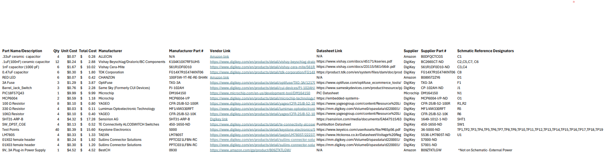

## Overview
BOM for Humidity and Temperature subsytem 

## Bill of Materials (as Table)

| Part Name/Description | Qty | Unit Cost | Total Cost | Manufacturer | Manufacturer Part # | Vendor Link | Datasheet Link | Supplier | Supplier Part # | Schematic Reference Designators |
|------------------------|-----|-----------|-------------|---------------|---------------------|--------------|----------------|-----------|------------------|----------------------------------|
| .33uF ceramic capacitor | 4 | $0.07 | $0.28 | ALLECIN | N/A | [Link](https://www.amazon.com) | N/A | Amazon | B0DFQCTCGS | C1 |
| .1uF (100nF) ceramic capacitor | 12 | $0.24 | $2.88 | Vishay Beyschlag/Draloric/BC Components | K104K10X7RF5UH5 | [Link](https://www.digikey.com/en/products/detail/vishay-beyschlag-draloric-bc-components/K104K10X7RF5UH5/2356879) | [PDF](https://www.vishay.com/docs/45171/kseries.pdf) | DigiKey | BC2665CT-ND | C2, C5, C7, C6 |
| 1nF capacitor (1000 pF) | 6 | $1.67 | $10.02 | Vishay Cera-Mite | 561R1DF0D10 | [Link](https://www.digikey.com/en/products/detail/vishay-cera-mite/561R1DF0D10/2825216) | [PDF](https://www.vishay.com/docs/23115/561r564r.pdf) | DigiKey | 561R1DF0D10-ND | C3, C4 |
| 0.47uF capacitor | 6 | $0.30 | $1.80 | TDK Corporation | FG14X7R1E474KNT06 | [Link](https://www.digikey.com/en/products/detail/tdk-corporation/FG14X7R1E474KNT06/5800326) | [PDF](https://product.tdk.com/en/system/files/dam/doc/product/capacitor/ceramic/lead-mlcc/catalog/leadmlcc_halogenfree_fg_en.pdf) | DigiKey | FG14X7R1E474KNT06 | C8 |
| RED LED | 6 | $0.07 | $0.42 | CHANZON | 100F5W-YT-RE-RE-SHAN | [Link](https://www.amazon.com) | N/A | Amazon | B0895T2ZY6 | D1 |
| 3A Fuse | 3 | $1.29 | $3.87 | OptiFuse | TXG-3A | [Link](https://www.digikey.com/en/products/detail/optifuse/TXG-3A/12170853) | [PDF](https://www.optifuse.com/optifuse_ecommerce_tools/datasheets/TXG.pdf) | DigiKey | TXG-3A | F1 |
| Barrel Jack Switch | 3 | $0.76 | $2.28 | Same Sky (Formerly CUI Devices) | PJ-102AH | [Link](https://www.digikey.com/en/products/detail/cui-devices/PJ-102AH/408448) | [PDF](https://www.sameskydevices.com/product/resource/pj-102ah.pdf) | DigiKey | CP-102AH-ND | J1 |
| PIC18F57Q43 | 1 | $9.99 | $9.99 | Microchip | DM164150 | [Link](https://www.microchip.com/en-us/development-tool/DM164150) | [PDF](https://www.microchip.com/en-us/product/PIC18F57Q43) | Microchip | DM164150 | N1 |
| MCP6004 | 2 | $0.59 | $1.18 | Microchip | MCP6004-I/P | [Link](https://www.digikey.com/en/products/detail/microchip-technology/MCP6004-I-P/523060) | [PDF](https://embedded-systems-design.bitbucket.io/304/labs/emitter-detector/) | DigiKey | MCP6004-I/P-ND | O1 |
| 100 Ω Resistor | 8 | $0.10 | $0.80 | YAGEO | CFR-25JB-52-100R | [Link](https://www.digikey.com/en/products/detail/yageo/CFR-25JB-52-100R/246) | [PDF](https://www.yageogroup.com/content/Resource%20Library/Datasheet/YAGEO-CFR_DATASHEET.pdf) | DigiKey | CFR-25JB-52-100R | R1, R2 |
| 330 Ω Resistor | 4 | $0.03 | $0.11 | Lumimax Optoelectronic Technology | MF1/4W330RFT | [Link](https://www.digikey.com/en/products/detail/lumimax-optoelectronic-technology/MF1-4W330RFT/16708267) | [PDF](https://mm.digikey.com/Volume0/opasdata/d220001/medias/docus/2592/MF%20Series.pdf) | DigiKey | MF1/4W330RFT | R5 |
| 10KΩ Resistor | 4 | $0.10 | $0.40 | YAGEO | CFR-25JB-52-10K | [Link](https://www.digikey.com/en/products/detail/yageo/CFR-25JB-52-10K/338) | [PDF](https://www.yageogroup.com/content/Resource%20Library/Datasheet/YAGEO-CFR_DATASHEET.pdf) | DigiKey | CFR-25JB-52-10K | R6 |
| SHT31-ARP-B | 4 | $4.32 | $17.28 | Sensirion AG | SHT31-ARP-B | [Link](https://www.digikey.com) | [PDF](https://sensirion.com/media/documents/EA647515/63A5A524/Datasheet_SHT3x_ARP.pdf) | DigiKey | 1649-1012-1-ND | SHT1 |
| SW_DPST_CGE | 4 | $0.13 | $0.52 | TE Connectivity ALCOSWITCH Switches | 450-1650-ND | [Link](https://www.digikey.com/en/products/detail/te-connectivity-alcoswitch-switches/1825910-6/1632536) | [PDF](https://www.te.com/usa-en/product-1825910-6.html) | DigiKey | 450-1650-ND | SW1 |
| Test Points | 40 | $0.39 | $15.60 | Keystone Electronics | 5000 | [Link](https://www.digikey.com/en/products/detail/keystone-electronics/5000/255326) | [PDF](https://www.keyelco.com/userAssets/file/M65p56.pdf) | DigiKey | 36-5000-ND | TP1–TP19 |
| LM7805 | 4 | $0.33 | $1.33 | TAEJIN | LM7805T | [Link](https://www.digikey.com/en/products/detail/taejin/LM7805T/22237260) | [PDF](https://www.htckorea.co.kr/Datasheet/Voltage%20Regulator/LM78xx.pdf) | DigiKey | 5536-LM7805T-ND | U1 |
| 01X02 female header | 8 | $0.24 | $1.92 | Sullins Connector Solutions | PPTC021LFBN-RC | [Link](https://www.digikey.com/en/products/detail/sullins-connector-solutions/PPTC021LFBN-RC/810142) | [PDF](https://mm.digikey.com/Volume0/opasdata/d220001/medias/docus/937/Female_Headers.100_DS.pdf) | DigiKey | S7000-ND |  |
| 01X03 female header | 4 | $0.30 | $1.20 | Sullins Connector Solutions | PPTC031LFBN-RC | [Link](https://www.digikey.com/en/products/detail/sullins-connector-solutions/PPTC031LFBN-RC/810143) | [PDF](https://mm.digikey.com/Volume0/opasdata/d220001/medias/docus/937/Female_Headers.100_DS.pdf) | DigiKey | S7001-ND |  |
| 9V, 3A Plug-in Power Supply | 1 | $4.52 | $4.52 | BestCH | 0930 | [Link](https://www.amazon.com/gp/product/B09ZTKTLGW/) | N/A | Amazon | B09ZTKTLGW | *Not on Schematic - External Power* |

## Bill of Materials (as Image)
{style width: "2000"}

