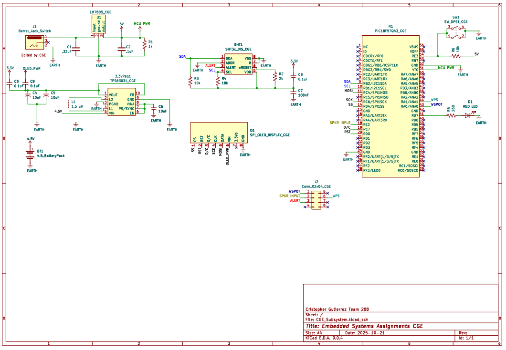

## Overview

This schematic serves illustartion to my subsystem within a water leak detection system. It is powered from a 9 V input through a 5 V regulator, which exclusively supplies the microcontroller. A debug LED provides visual system feedback.

A secondary 4.5 V (3×AA) battery pack feeds a 3.3 V regulator that powers the SHT3x humidity sensor and an SPI-OLED display. The SHT3x communicates with the PIC via I²C (SDA, SCL) and asserts an ALERT signal when humidity thresholds are exceeded.

Subsystems are interconnected through a 2×4 ribbon cable that coordinates signals between team boards. The PIC outputs an alert signal on pin 6 to a teammate’s subsystem equipped with a speaker, and also receives inputs from a water spot detector and water pressure sensor.

When a loss of pressure, presence of water, or high humidity is detected, the system triggers the speaker for an audible warning and displays a corresponding notification message on the OLED. A momentary debug push button is included for manual resets via the MCLR line.

{style width:"350" height:"300;"}

## Resouces

The schematic as a PDF download is available [*here*](CGE_Subsystem.pdf), and the Zip folder of the project [*here*](CGE_Subsystem.zip).
