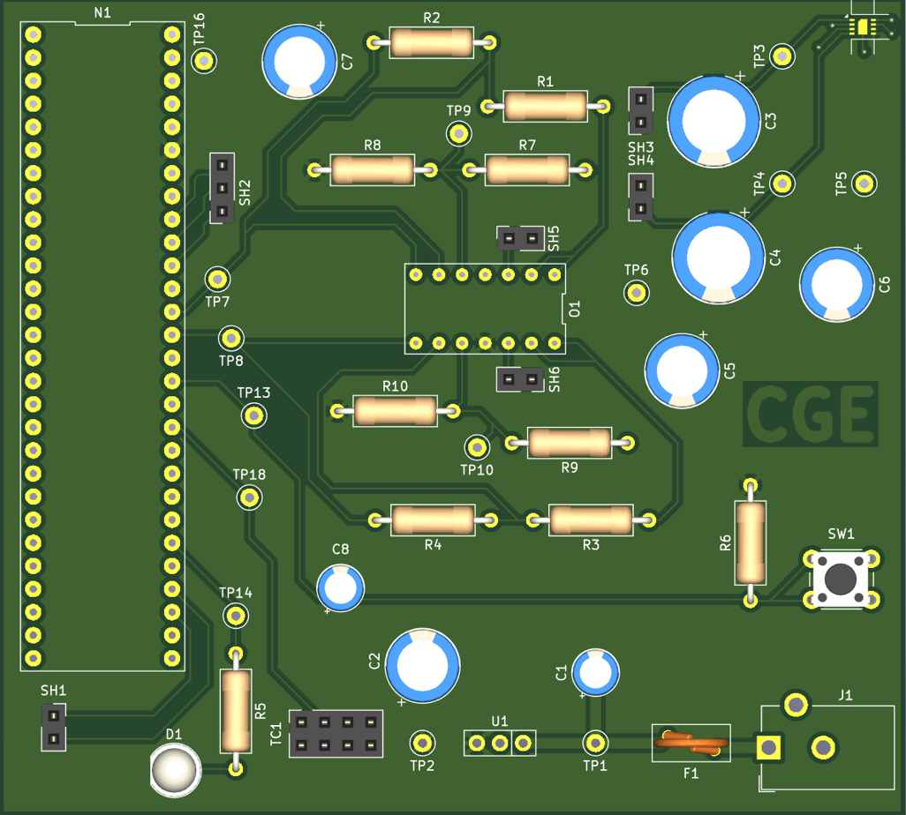
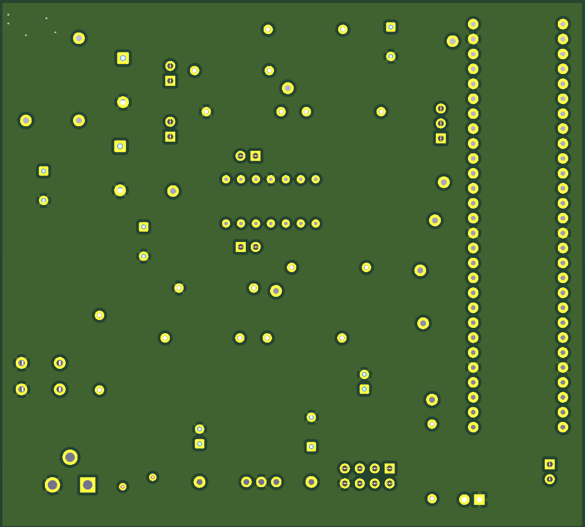

*PCB before assembly*

  
{style="width:350px; height:300px;"}

*PCB, after soldering and testing*

{style="width:350px; height:300px;"}

{style="width:350px; height:300px;"}

*Front view:*

{style="width:350px; height:300px;"}

*Back view:*

{style="width:350px; height:300px;"}

## LINKS

The PCB as a PDF download is available [*here*](updatedFnB.pdf), and the Zip folder of the project [*here*](CGE_Subsystem.zip).

Gerber Files [*here*](CristopherGE208.zip).
