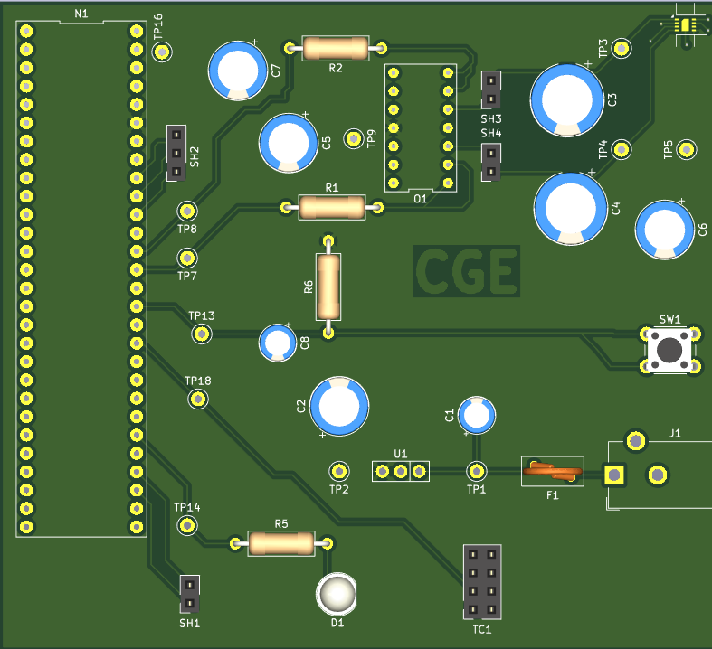

PCB 

{style width:"350" height:"300;"}

{style width:"350" height:"300;"}

## LINKS

The PCB as a PDF download is available [*here*](PCB_FandB.pdf), and the Zip folder of the project [*here*](CGE_Subsystem.zip).

Gerber Files [*here*](Cristopher208.zip).

