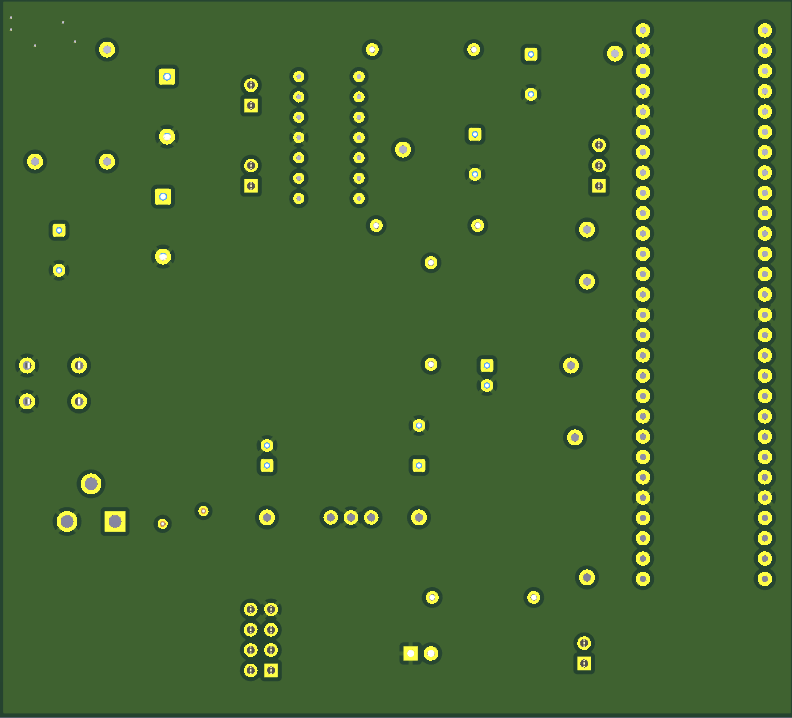

PCB 

*Front view:*

{style width:"350" height:"300;"}

*Back view:*

{style width:"350" height:"300;"}

## LINKS

The PCB as a PDF download is available [*here*](U_FnB.pdf), and the Zip folder of the project [*here*](CGE_Subsystem.zip).

Gerber Files [*here*](updated_Cristopher208.zip).

